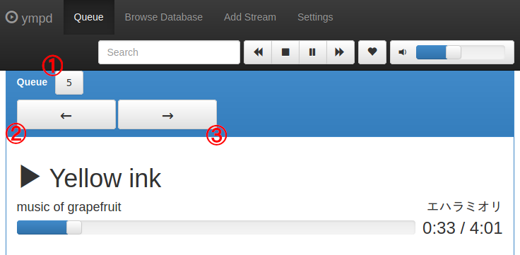
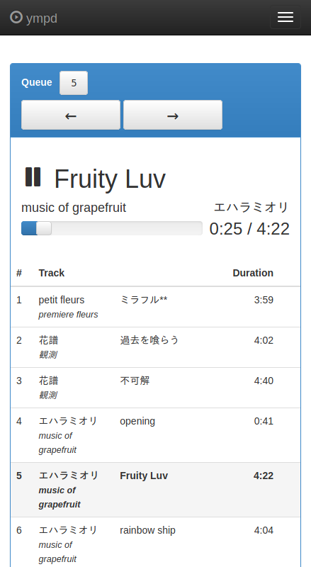
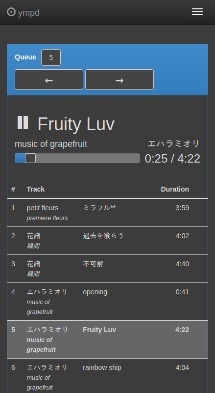
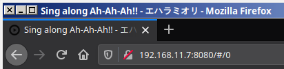
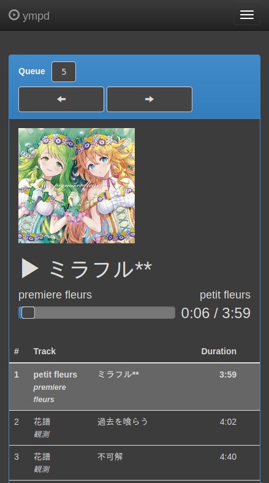
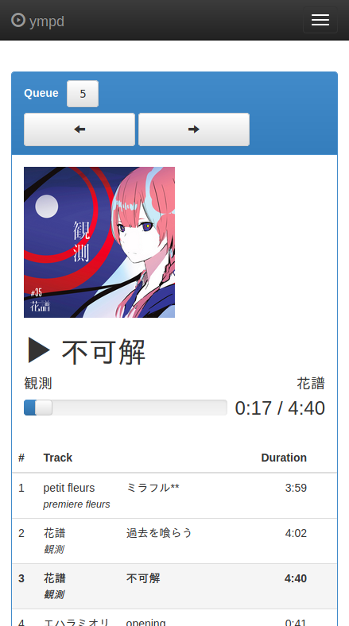

# ympd++

This project is a fork of the original [`ympd`](https://www.ympd.org/). It seems the original has been abandoned; the last commit dates back to 2018 and numerous pull requests are ignored.

## Development

### Branches

We use `customized` branch as the main branch and keep `master` branch untouched.

### References

- [`libmpdclient` documentation](https://www.musicpd.org/doc/libmpdclient/index.html)

- [Git repository of the original `ympd`](https://github.com/notandy/ympd)

## Build

### Without Installation

This builds the project and starts `ympd` in the foreground.

```bash
$ ./build.sh
```

### With Installation

This builds the project and installs `ympd`.

```bash
$ ./build.sh --install
```

## Requirements

See [README_original.md](./README_original.md).

## Tested Environments

### Build Environments

- Raspbian Buster on Raspberry Pi 3

### Server Environments

- Raspbian Buster on Raspberry Pi 3

### Client Environments

- Firefox on Arch Linux

- Firefox on Android

## New Features

### 0. Index

- Backward-Incompatible Changes

- Keyboard Seek

- Dark Mode

- Informative Page Title

- Cover Art Display

### 1. Backward-Incompatible Changes

- <kbd>←</kbd> and <kbd>→</kbd> were used to go to the previous/next song, but now the keyboard bindings are changed to <kbd>h</kbd> and <kbd>l</kbd> respectively.

### 2. Keyboard Seek

You can seek the current song for `seek_length` seconds

- with <kbd>←</kbd> and <kbd>→</kbd> keys

- or by clicking `←` / `→` buttons (see the figure below).

The default value of `seek_length` is `5` and it can be increased/decreased

- with <kbd>↑</kbd> and <kbd>↓</kbd> keys

- or by clicking the button in which the value of `seek_length` is displayed (see the figure below).

|  |
|:-:|
| Fig: Buttons for seeking. The numbered buttons are newly added. |

### 3. Dark Mode

Dark mode is implemented and is enabled by default. You can toggle it by pressing <kbd>D</kbd> (i.e. <kbd>Shift</kbd> + <kbd>d</kbd>).

|  |  |
|:-:|:-:|
| Fig. Non dark mode. | Fig. Dark mode. |

### 4. Informative Page Title

Now the page title is dynamically updated to the information of the current song. This is related to [Issue 128](https://github.com/notandy/ympd/issues/128).

|  |
|:-:|
| Fig: Page title with song information. |

### 5. Cover Art Display

### 5.1. Explanation of This Feature

If `cover_ympd.jpg` file exists under the same directory in which the current song resides, it is displayed as a cover art. When you move to a different song, of course, the cover art display is automatically updated. See the figure below.

### 5.2. Requirements

- The `mpd`'s `music_directory`, which is normally set in `/etc/mpd.conf`, shall be `/media/MUSIC/`. If you'd like to use another directory, change the value of the macro `__MPD_MUSIC_DIRECTORY` in `src/mpd_client.h` and rebuild. This limitation comes from the fact that [`mpd_song_get_uri()`](https://www.musicpd.org/doc/libmpdclient/song_8h.html#a8bf8a5fe7792142bb4e8b9f8c8aa41c6) returns a path relative to `music_directory`.

- As described above, the name of cover arts shall be `cover_ympd.jpg`. And it is recommended they are small in size (e.g. `<= 1MB`) for a speedy operation. We supply `helper_scripts/create_cover_art.sh` script to recursively create `cover_ympd.jpg` files from `cover.jpg` and `cover.png` in the specified directory. Note it needs `imagemagick`. Usage:

```bash
$ cd helper_scripts && ./create_cover_art.sh <directory>
```

### 5.3. Implementation Details

`ympd` server communicates with a browser using WebSockets. To update information such as a song's title, the artist's name, etc., they are sent as a JSON string. We extend this implementation to incorporate a base64-encoded image file into the string.

|  |  |
|:-:|:-:|
| Fig. Cover art display. | Fig. Another example of cover art display. |

## Known Bugs

- Cover art display is unstable when `ympd` is accessed from multiple browsers at the same time. We cannot identify the cause yet. Current workaround: just reload the page.

<!-- vim: set spell: -->

